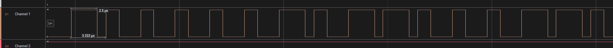

# DShot ESC Communication Library for Arduino

## Overview
This library provides a simple implementation of the DShot protocol for communicating with electronic speed controllers (ESCs) using an Arduino. DShot is a digital protocol used for high-speed and precise control of brushless motors, commonly used in drones and RC vehicles.

## Requirements
- For now the library works only with atmega328 (or other boards with 16 MHz clock) and DShot300 protocol

## Usage
### Wiring
Connect the signal wires of the ESC to the appropriate Arduino digital pins.

### Function Descriptions

#### `void dshot_init(int8_t pin);`
This function initializes the DShot communication on the specified pin by sending a series of 0-bit frames to the ESC.
- `pin`: The digital output pin connected to the ESC signal wire.

#### `void dshot_run(int16_t throttle, int8_t pin);`
This function sends a 16-bit DShot command containing the throttle value and CRC checksum.
- `throttle`: 11-bit throttle value (0-2047), where 48-2047 represents valid throttle values, and 0-47 are special commands.

### Code Example
```cpp
#include <Arduino.h>
#include "Dshot.h"

void setup() {
    dshot_init(9); // Initialize DShot communication on pin 9
}

void loop() {
    int16_t throttle = 1046;
    dshot_run(throttle, 9);  // Send DShot frame to pin 9
    delay(1);
}
```

### Timing Details
- HIGH signal duration:
  - 1-bit: ~2.55 µs high, 0.8 µs low
  - 0-bit: ~1.25 µs high, 2.05 µs low
- Cycle time: ~3.33 µs per bit

### CRC Calculation
A 4-bit CRC checksum is appended to each DShot command to ensure data integrity. It is calculated using:
```cpp
uint8_t crc = (value ^ (value >> 4) ^ (value >> 8)) & 0x0F;
```




## Notes
- The library uses direct register access (`PORTx` and `DDRx`) for fast execution.
- Interrupts are disabled during communication to ensure precise timing.
- More details: https://brushlesswhoop.com/dshot-and-bidirectional-dshot/

Tested it on `BLS 55A 4in1 ESC` from Speedybee and it works fine. 

